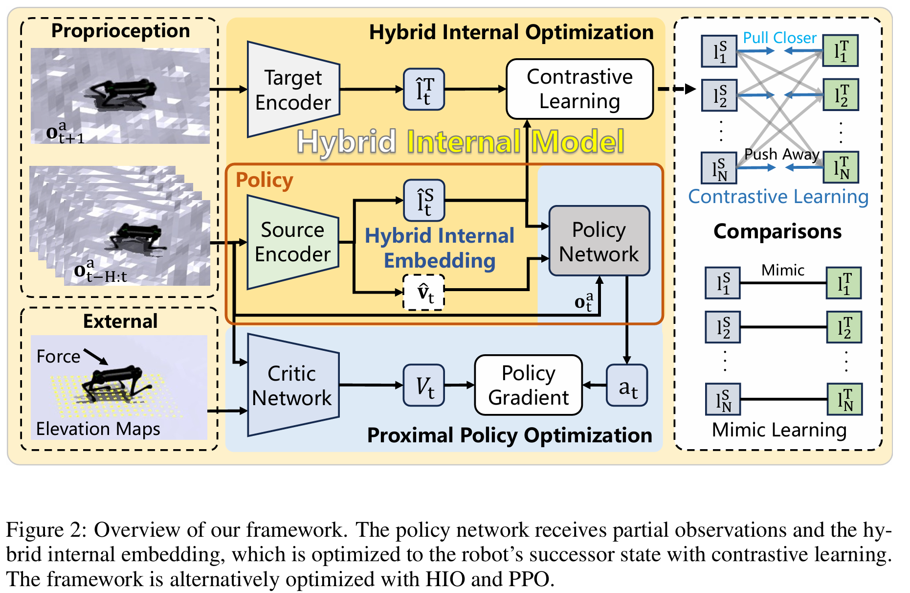

# HIMLOCO_GO2
说明：本仓库仅保存了阶段性版本(无历史提交记录)

名词解释(复现了以下论文)：
- HIMLoco：论文[Hybrid Internal Model](https://arxiv.org/abs/2312.11460)算法实现
- H-Infinity：论文[H-Infinity Locomotion Control](https://arxiv.org/abs/2404.14405)算法实现
 
1.  原项目信息
- 原项目地址：https://github.com/OpenRobotLab/HIMLoco
- 原项目说明：
  - 只实现了HIMLoco，未实现H-Infinity
  - 未实现deploy代码
2.	本项目工作
- 实现了HIMLoco在unitree go2上的deploy代码
3.	HIMLoco算法架构
- HIMLoco算法架构：

4.	运行程序
- Install HIMLoco
   - cd rsl_rl && pip install -e .
   - cd ../legged_gym && pip install -e .
- Train a policy
   - cd legged_gym/legged_gym/scripts
   - python train.py
- Play and export the latest policy
   - cd legged_gym/legged_gym/scripts
   - python play.py
- Deploy
   - cd legged_gym/deploy/deploy_real
   - python deploy_real_go2.py <网卡名称> go2.ymal
5.	Demo演示

- 观看项目演示视频：[点击这里](https://www.bilibili.com/video/BV1CSXNYbEn4/?spm_id_from=333.1387.upload.video_card.click&vd_source=032f2f8aec6b50da9d8cb77f6a494111)

python3.8 -m pip install "numpy<1.24" pydelatin wandb tqdm opencv-python ipdb pyfqmr flask

modal run -d himloco_go2_train.py::main --mode train --num-envs 8192 --wandb-mode online

在线：python legged_gym/legged_gym/scripts/train.py --num-envs 8192 --wandb-mode online
离线：python legged_gym/legged_gym/scripts/train.py --num-envs 8192 --wandb-mode offline
禁用：python legged_gym/legged_gym/scripts/train.py --num-envs 8192 --wandb-mode disabled

